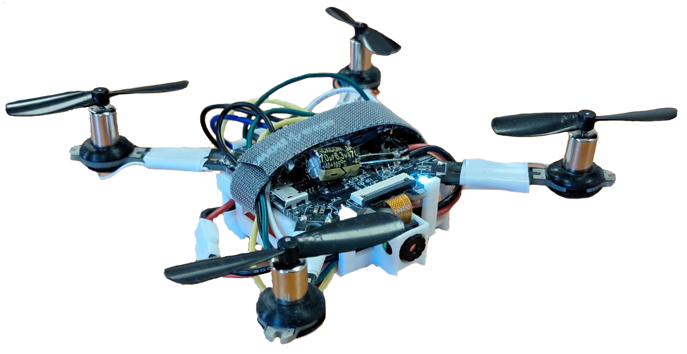
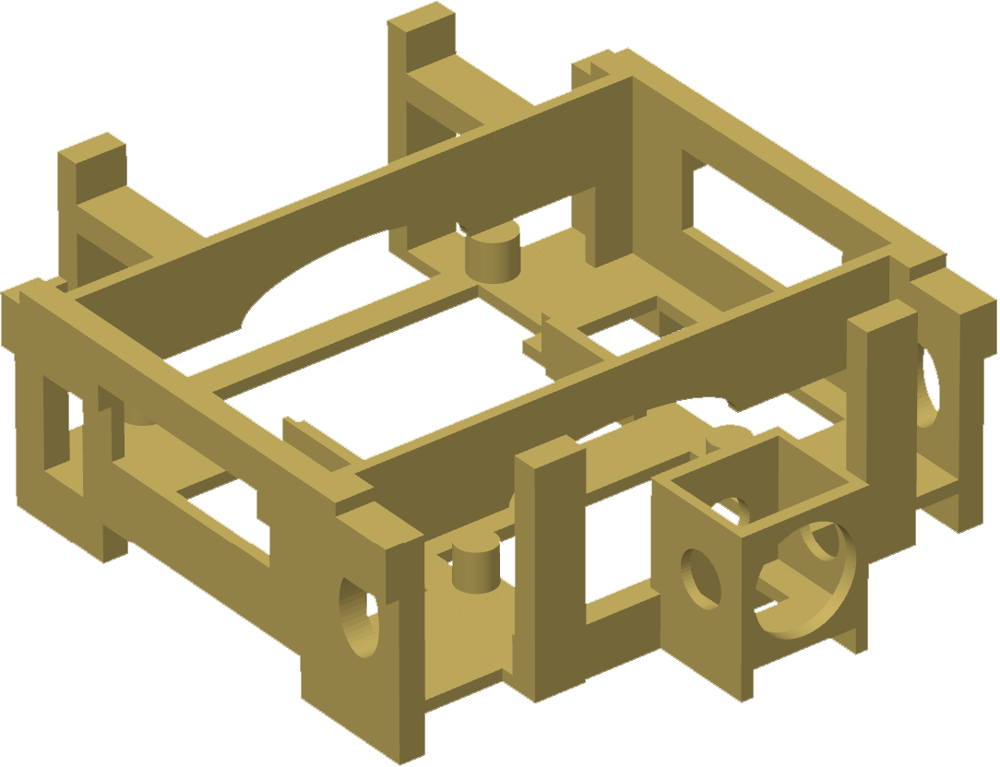
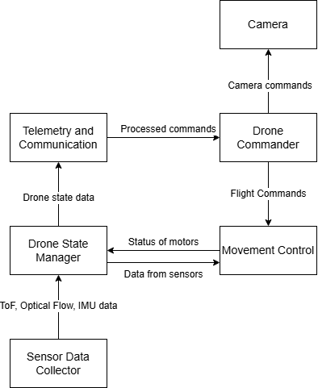
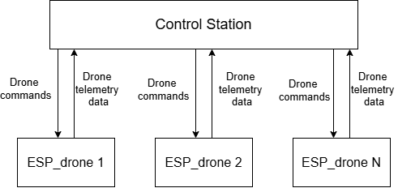
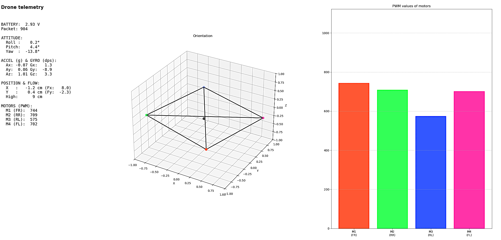
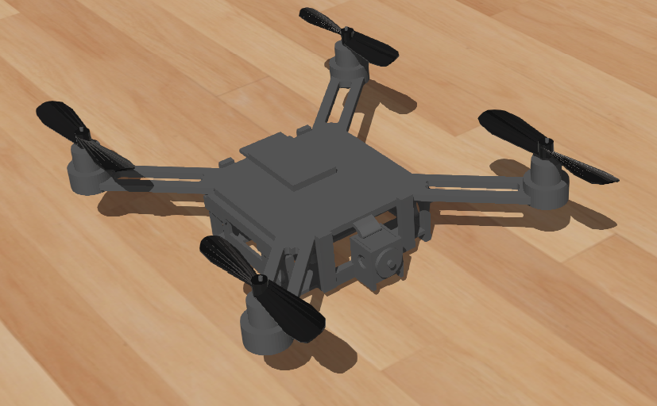
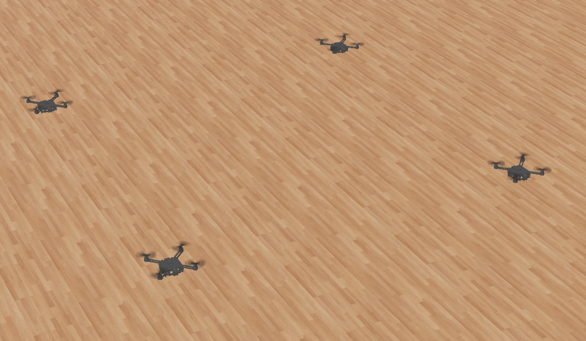

# The Use of Robotic Frameworks in Tasks of Swarm Robotics

This repository accompanies the paper *"The Use of Robotic Frameworks in Tasks of Swarm Robotics"* by Ing. Jakub Suďa and doc. Dr. Ing. Ján Vaščák (Technical University of Košice). It contains supplementary material, figures, and source code for a low-cost indoor UAV platform and centralised ground-control framework developed for aerial swarm coordination.

## Overview

A custom ESP32-based UAV and a Python Ground Control Station (GCS) were developed to coordinate small aerial swarms indoors, along with a matching Webots simulation model. Physical trials confirmed stable attitude control but not reliable autonomous position hold, so advanced swarm behaviours — formation control, group splitting/merging, and coordinated motion — were validated in simulation instead, successfully up to 16 UAVs, with scalability limits appearing at 32 and 64 UAVs due to centralised command dispatch.

## Proposed UAV Platform

The platform is built on a low-cost ESP32 drone base, extended for indoor flight. Beyond the stock MPU-6050 IMU (gyroscope + accelerometer), it adds a **PMW3901 optical-flow sensor** for horizontal position estimation and a **VL53L1X Time-of-Flight sensor** for altitude sensing, since GNSS is unavailable indoors.

## Firmware

The flight controller is written in C/C++ using **FreeRTOS** via ESP-IDF (v5.5) for the ESP32-S2. Firmware is split into modular components: a Sensor Data Collector, a Drone State Manager, a Movement Control module running cascaded PID loops (500 Hz attitude, outer altitude/drift loop), and a Telemetry & Commander module that exchanges UDP data with the GCS.

## Ground Control Framework

The GCS is a Python framework that discovers UAVs via ICMP ping sweeps, receives and logs real-time UDP telemetry, and computes swarm coordination commands using a displacement-based spatial model. This model translates each UAV's local sensor frame into a shared global frame and drives formation control, group splitting/merging, and de-conflicted circular arrangements.

## Simulation Model

A Webots model replicates the physical drone's key properties (weight, propeller size), enabling repeatable swarm-scale testing beyond what the physical hardware could support.

## Key Results

- Attitude stabilisation kept roll/pitch deviation under 2° in physical trials, but position hold was unreliable due to the lack of a magnetometer and payload-induced thrust/vibration effects.
- Simulated swarms of up to 16 UAVs ran correctly; command lag appeared at 32 UAVs and became severe at 64 UAVs, tracing to serialised UDP command dispatch rather than the spatial-reasoning algorithms.

## Contact

- jakub.suda@tuke.sk
- jan.vascak@tuke.sk
